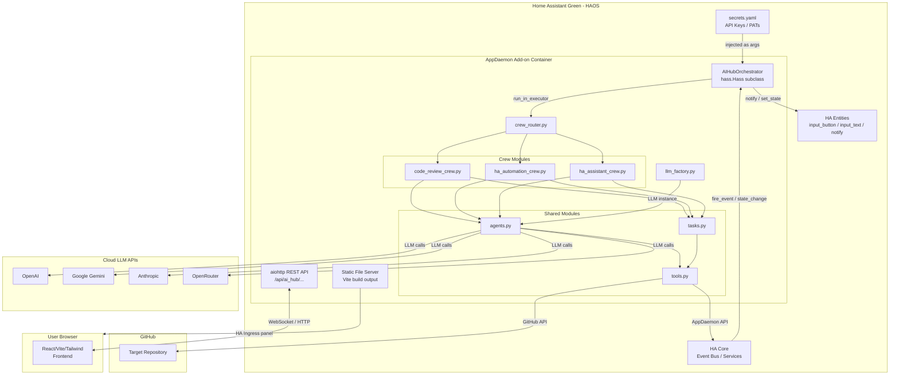
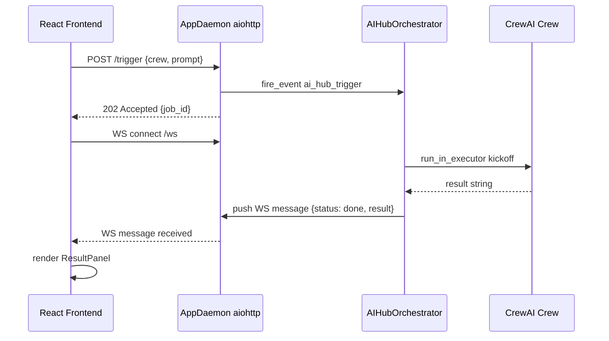
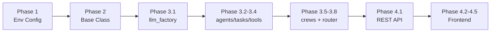

# Architecture Plan: Multi-Agent AI Hub on Home Assistant OS

## Project Summary

A locally-hosted, multi-agent AI orchestration system running inside the **AppDaemon** add-on on a **Home Assistant Green** device. CrewAI handles agent orchestration; all heavy LLM inference is offloaded to cloud APIs (OpenAI, Gemini, Anthropic, OpenRouter — configurable). A React/Vite/Tailwind frontend is served via HA Ingress.

---

## System Architecture Overview



---

## Phase 1: AppDaemon Environment Configuration

### 1.1 — `appdaemon.yaml`

**File:** `/config/appdaemon/appdaemon.yaml`

Key configuration sections:
- `appdaemon.plugins.HASS` — connects to HA via long-lived token from `secrets.yaml`
- `appdaemon.python_packages` — installs all required packages at add-on startup
- `appdaemon.threads` — set to `10` to allow concurrent crew executions without blocking the event loop
- `http.url` — exposes the aiohttp API endpoint used by the frontend

**`python_packages` array (exact list):**
```
crewai
crewai-tools
langchain-openai
langchain-google-genai
langchain-anthropic
langchain-community
openai
google-generativeai
anthropic
github3.py
aiohttp
aiofiles
pydantic>=2.0
```

### 1.2 — Folder Structure

```
/config/appdaemon/
├── appdaemon.yaml
├── apps/
│   └── ai_hub/
│       ├── apps.yaml                  # AppDaemon app registration
│       ├── main.py                    # AIHubOrchestrator (hass.Hass subclass)
│       ├── crew_router.py             # Runtime crew selector
│       ├── llm_factory.py             # Configurable LLM provider factory
│       ├── agents.py                  # All CrewAI Agent definitions
│       ├── tasks.py                   # All CrewAI Task definitions
│       ├── tools.py                   # Custom CrewAI Tools
│       ├── crews/
│       │   ├── __init__.py
│       │   ├── code_review_crew.py    # Developer → Reviewer → DevOps crew
│       │   ├── ha_automation_crew.py  # NL → HA YAML → GitHub crew
│       │   └── ha_assistant_crew.py   # Sensor reader + automation suggester crew
│       └── frontend/
│           ├── dist/                  # Vite build output (served as static files)
│           └── src/                   # React source (developed externally, built here)
```

### 1.3 — Secrets & API Key Injection

**Pattern:** All secrets live in `/config/secrets.yaml` (HA's native secret store). They are passed into the AppDaemon app as `args` in `apps.yaml` using the `!secret` YAML tag. The `AIHubOrchestrator.initialize()` method reads them from `self.args`.

**`/config/secrets.yaml` additions:**
```yaml
appdaemon_token: "YOUR_HA_LONG_LIVED_TOKEN"
openai_api_key: "sk-..."
gemini_api_key: "AIza..."
anthropic_api_key: "sk-ant-..."
openrouter_api_key: "sk-or-..."
github_pat: "ghp_..."
github_repo_owner: "your-username"
github_repo_name: "your-repo"
active_llm_provider: "openai"   # openai | gemini | anthropic | openrouter
active_llm_model: "gpt-4o"
```

### 1.4 — `apps.yaml`

**File:** `/config/appdaemon/apps/ai_hub/apps.yaml`

```yaml
ai_hub_orchestrator:
  module: main
  class: AIHubOrchestrator
  # Trigger entity
  trigger_event: "ai_hub_trigger"
  result_entity: "input_text.ai_hub_result"
  status_entity: "input_text.ai_hub_status"
  # LLM config
  active_llm_provider: !secret active_llm_provider
  active_llm_model: !secret active_llm_model
  openai_api_key: !secret openai_api_key
  gemini_api_key: !secret gemini_api_key
  anthropic_api_key: !secret anthropic_api_key
  openrouter_api_key: !secret openrouter_api_key
  # GitHub config
  github_pat: !secret github_pat
  github_repo_owner: !secret github_repo_owner
  github_repo_name: !secret github_repo_name
```

---

## Phase 2: AppDaemon Base Class Integration

### 2.1 — `main.py` — `AIHubOrchestrator`

**Class:** `AIHubOrchestrator(hass.Hass)`

**Key responsibilities:**
- `initialize()` — registers HA event listener on `ai_hub_trigger`
- `on_trigger()` — validates payload, updates status entity, dispatches to executor
- `_run_crew_async()` — runs in a thread pool via `self.run_in_executor`; calls `crew_router.route()`
- `_report_result()` — writes result to `input_text.ai_hub_result` via `self.set_state()`
- `_report_error()` — writes error to status entity and fires `ai_hub_error` event
- `_notify()` — sends HA persistent notification via `self.call_service("notify/notify")`

### 2.2 — Trigger Mechanism

The system listens for a **custom HA event** `ai_hub_trigger` (fired via HA automation, script, or the frontend webhook). The event `data` payload carries:

```json
{
  "crew": "code_review",
  "prompt": "Write a Python function that parses YAML files",
  "options": {}
}
```

Valid `crew` values: `code_review` | `ha_automation` | `ha_assistant`

### 2.3 — Async Execution Pattern

```
initialize()
  └─ listen_event("ai_hub_trigger", on_trigger)

on_trigger(event_name, data, kwargs)
  └─ set_state(status_entity, "running")
  └─ self.run_in_executor(None, _run_crew_sync, data)
       └─ [thread pool] crew_router.route(data)
            └─ crew.kickoff()  ← blocking, network-heavy
       └─ [callback] _report_result(result)
```

`run_in_executor` offloads the blocking `kickoff()` call to a thread pool, keeping the AppDaemon event loop free.

### 2.4 — HA Entity Requirements

Create these helper entities in HA (`/config/configuration.yaml`):

```yaml
input_text:
  ai_hub_result:
    name: "AI Hub Result"
    max: 255
    initial: ""
  ai_hub_status:
    name: "AI Hub Status"
    max: 50
    initial: "idle"

input_button:
  trigger_ai_hub:
    name: "Trigger AI Hub"
```

### 2.5 — Error Handling Strategy

| Error Type | Handling |
|---|---|
| Cloud API timeout | `try/except` with 3 retries + exponential backoff; report to `ai_hub_status` |
| GitHub API rate limit | Catch `github3.exceptions.RateLimitExceeded`; report remaining reset time |
| Invalid crew name | Validate in `crew_router.py` before kickoff; fire `ai_hub_error` event |
| CrewAI internal error | Catch broad `Exception`; log full traceback to AppDaemon log + notify HA |
| Missing API key | Check in `llm_factory.py` at startup; raise `ValueError` with clear message |

---

## Phase 3: CrewAI Multi-Agent Architecture

### 3.1 — `llm_factory.py` — Configurable LLM Provider

**Function:** `get_llm(provider: str, model: str, api_key: str) -> BaseChatModel`

Supports:
- `"openai"` → `ChatOpenAI` from `langchain_openai`
- `"gemini"` → `ChatGoogleGenerativeAI` from `langchain_google_genai`
- `"anthropic"` → `ChatAnthropic` from `langchain_anthropic`
- `"openrouter"` → `ChatOpenAI` with `base_url="https://openrouter.ai/api/v1"` override

The factory reads `provider` and `model` from `self.args` (injected from `apps.yaml`/`secrets.yaml`), so switching providers requires only a `secrets.yaml` change — no code edits.

### 3.2 — `agents.py` — Agent Definitions

| Agent | Role | Tools Used |
|---|---|---|
| `developer_agent` | Writes code based on user prompt | None (pure LLM) |
| `reviewer_agent` | Reviews code for quality, security, bugs | None (pure LLM) |
| `devops_agent` | Prepares and commits approved code to GitHub | `GitHubCommitTool` |
| `ha_automation_agent` | Generates HA automation YAML from NL prompt | `HASensorReaderTool` |
| `ha_assistant_agent` | Reads sensor states, suggests automations | `HASensorReaderTool` |

All agents receive the LLM instance from `llm_factory.get_llm()`.

### 3.3 — `tasks.py` — Task Definitions

Tasks are defined as functions that accept agent instances and return `Task` objects. Context chaining uses CrewAI's `context=[previous_task]` parameter.

**Code Review Crew tasks:**
1. `write_code_task(agent, prompt)` — Developer writes code
2. `review_code_task(agent, context)` — Reviewer critiques output of task 1
3. `commit_code_task(agent, context)` — DevOps commits approved code from task 2

**HA Automation Crew tasks:**
1. `read_ha_state_task(agent, entities)` — reads current HA entity states
2. `generate_automation_task(agent, prompt, context)` — generates YAML automation
3. `commit_automation_task(agent, context)` — commits YAML to GitHub

**HA Assistant Crew tasks:**
1. `survey_sensors_task(agent, entities)` — reads multiple sensor states
2. `suggest_automations_task(agent, context)` — suggests automations based on sensor data
3. `apply_automation_task(agent, context)` — optionally applies suggestion via HA service call

### 3.4 — `tools.py` — Custom CrewAI Tools

#### `GitHubCommitTool`
- **Inherits:** `crewai.tools.BaseTool`
- **Input schema:** `{ filename: str, content: str, commit_message: str }`
- **Logic:** Uses `github3.py` to authenticate with PAT, get/create file in repo, commit
- **Error handling:** Catches `RateLimitExceeded`, `NotFoundError`, network errors

#### `HASensorReaderTool`
- **Inherits:** `crewai.tools.BaseTool`
- **Input schema:** `{ entity_id: str }`
- **Logic:** Uses AppDaemon's `self.get_state(entity_id)` — requires the tool to hold a reference to the `hass.Hass` instance (passed at construction time)
- **Returns:** `{ entity_id, state, attributes, last_changed }`

### 3.5–3.7 — Crew Modules

Each crew module in `crews/` follows this pattern:

```python
class CodeReviewCrew:
    def __init__(self, llm, github_tool, **kwargs):
        ...
    def build(self, prompt: str) -> Crew:
        # instantiate agents, tasks, return Crew(...)
    def kickoff(self, prompt: str) -> str:
        return self.build(prompt).kickoff()
```

### 3.8 — `crew_router.py` — Runtime Crew Selector

```python
CREW_MAP = {
    "code_review":    CodeReviewCrew,
    "ha_automation":  HAAutomationCrew,
    "ha_assistant":   HAAssistantCrew,
}

def route(payload: dict, llm, tools: dict) -> str:
    crew_name = payload.get("crew")
    if crew_name not in CREW_MAP:
        raise ValueError(f"Unknown crew: {crew_name}")
    crew = CREW_MAP[crew_name](llm=llm, **tools)
    return crew.kickoff(prompt=payload["prompt"])
```

---

## Phase 4: Frontend Hub (React/Vite/Tailwind via HA Ingress)

### 4.1 — REST API Layer (aiohttp inside AppDaemon)

AppDaemon exposes a built-in aiohttp server. We register custom endpoints in `initialize()`:

| Endpoint | Method | Description |
|---|---|---|
| `/api/appdaemon/ai_hub/trigger` | POST | Fire a crew trigger with `{crew, prompt}` payload |
| `/api/appdaemon/ai_hub/status` | GET | Return current `ai_hub_status` entity state |
| `/api/appdaemon/ai_hub/result` | GET | Return last result from `ai_hub_result` entity |
| `/api/appdaemon/ai_hub/ws` | WebSocket | Push real-time status/result updates to frontend |

Authentication: AppDaemon API token (set in `appdaemon.yaml` → `http.password`).

### 4.2 — Frontend Project Structure

```
/config/appdaemon/apps/ai_hub/frontend/
├── package.json
├── vite.config.ts
├── tailwind.config.ts
├── index.html
└── src/
    ├── main.tsx
    ├── App.tsx
    ├── api/
    │   └── aiHubClient.ts       # fetch + WebSocket wrapper
    ├── components/
    │   ├── CrewSelector.tsx     # Dropdown: code_review | ha_automation | ha_assistant
    │   ├── PromptInput.tsx      # Textarea + Submit button
    │   ├── StatusBadge.tsx      # idle | running | done | error
    │   ├── StatusFeed.tsx       # Live log stream via WebSocket
    │   └── ResultPanel.tsx      # Markdown-rendered final output
    └── hooks/
        └── useCrewStatus.ts     # WebSocket hook for real-time updates
```

### 4.3 — Async Result Delivery



### 4.4 — HA Ingress Integration

Add to `/config/configuration.yaml`:

```yaml
panel_iframe:
  ai_hub:
    title: "AI Hub"
    icon: mdi:robot
    url: "http://homeassistant.local:5050/api/appdaemon/ai_hub/"
    require_admin: true
```

The AppDaemon HTTP server (port 5050) serves the Vite `dist/` build as static files from the `frontend/dist/` directory.

### 4.5 — Frontend Component Blueprint

| Component | Props / State | Behaviour |
|---|---|---|
| `CrewSelector` | `value`, `onChange` | Renders 3 crew options as styled radio cards |
| `PromptInput` | `onSubmit(crew, prompt)` | Textarea with char counter; disabled while running |
| `StatusBadge` | `status: idle/running/done/error` | Animated pill badge with colour coding |
| `StatusFeed` | `messages: string[]` | Scrolling log of agent step outputs via WS |
| `ResultPanel` | `result: string` | Renders markdown output with copy-to-clipboard |

---

## Development Guidelines (from spec)

| Concern | Implementation |
|---|---|
| **Modularity** | Each concern in its own `.py` file; `main.py` only orchestrates |
| **Async safety** | `crew.kickoff()` always runs in `run_in_executor` — never on the event loop |
| **Error reporting** | All exceptions caught, logged to AppDaemon log AND reported to HA entity |
| **Secret management** | Zero hardcoded keys; all via `secrets.yaml` → `apps.yaml` args |
| **LLM switching** | Change `active_llm_provider` + `active_llm_model` in `secrets.yaml`, restart add-on |

---

## Implementation Order (Recommended)



Start with **Phase 1 + Phase 2** to get a working HA integration skeleton before adding CrewAI complexity.
